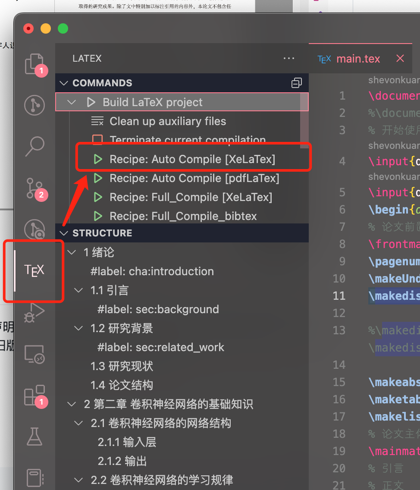

本科毕业论文Latex模板
==========

## 介绍

本项目借用中山大学[Lovely-XPP/SYSU-thesis](https://github.com/Lovely-XPP/SYSU-thesis) 模板定义，重新构建了`scutthesis.cls`模板文件。

(注：由于`newtext`宏包的原因，不支持 Github Action 在线编译)

具体效果点[这里](./main.pdf)

## 要求

为了获得最佳体验，请使用 [TeX Live 2025](https://www.tug.org/texlive/) 或更高版本。
编译文档需要使用 XeLaTeX 或 LuaLaTeX。

## 安装

有以下几种方式可以安装和更新该模板，请选择最适合您的方法。

### 在线使用

您可以直接使用第三方 LaTeX 线上编译平台模板库 [TeXPage](https://www.texpage.com/template/4d9fefbf-2d5d-4d89-802d-124530cab9cf)，或者[Overleaf](https://www.overleaf.com/latex/templates/hustthesis-hua-zhong-ke-ji-da-xue-yan-jiu-sheng-xue-wei-lun-wen-mo-ban/shkvgmnkhcxc).


### 本地安装

您可以从 [GitHub] 下载[wzu_graduate_thesis_latex](https://github.com/sibioa/wzu_graduate_thesis_latex)，并解压到合适的目录使用。


## 如何编译？

### `vscode`编译（强烈推荐）

极力推荐使用`vscode`作为编辑器，真的不要再用`TexStudio`这种老古董了，`vscode`的插件生态非常好，而且有非常多的自定义功能（例如字数统计等），写 $\LaTeX$ 简直不要太爽。

1. 安装`vscode`，安装`LaTeX Workshop`插件，安装`LaTeX Utilities`插件；
2. 在`settings.json`配置文件（按住`ctrl+shift+p`或者`⌘+shift+p`打开命令列表，输入`json`选择`Preferences: Open User Settings (JSON)`），中添加以下配置
    ```json
    {
        "latex-workshop.latex.tools": [
            {
                // 编译工具和命令
                "name": "xelatex",
                "command": "xelatex",
                "args": [
                    "-synctex=1",
                    "-interaction=nonstopmode",
                    "-file-line-error",
                    "-shell-escape",
                    "%DOCFILE%"
                ]
            },
            {
                "name": "latexmk",
                "command": "latexmk",
                "args": [
                    "-xelatex",
                    "-synctex=1",
                    "-interaction=nonstopmode",
                    "-file-line-error",
                    "-shell-escape",
                    "%DOCFILE%"
                ]
            },
            {
                "name": "latexmk_pdf",
                "command": "latexmk",
                "args": [
                    "-pdf",
                    "-synctex=1",
                    "-interaction=nonstopmode",
                    "-file-line-error",
                    "-shell-escape",
                    "%DOCFILE%"
                ]
            },
            {
                "name": "pdflatex",
                "command": "pdflatex",
                "args": [
                    "-synctex=1",
                    "-interaction=nonstopmode",
                    "-file-line-error",
                    "%DOCFILE%"
                ]
            },
            {
                "name": "bibtex",
                "command": "bibtex",
                "args": ["%DOCFILE%"]
            },
            {
                "name": "texindy",
                "command": "texindy",
                "args": ["%DOCFILE%.idx"]
            },
            {
                "name": "makeindex",
                "command": "makeindex",
                "args": [
                    "%DOCFILE%.nlo",
                    "-s",
                    "nomencl.ist",
                    "-o",
                    "%DOCFILE%.nls"
                ]
            }
        ],
        "latex-workshop.latex.recipes": [
            {
                "name": "Auto Compile [XeLaTex]",
                "tools": ["latexmk"]
            },
            {
                "name": "Auto Compile [pdfLaTex]",
                "tools": ["latexmk_pdf"]
            },
            {
                "name": "Full_Compile [XeLaTex]",
                "tools": [
                    "xelatex",
                    "makeindex",
                    "texindy",
                    "xelatex",
                    "xelatex"
                ]
            },
            {
                "name": "Full_Compile_bibtex",
                "tools": [
                    "xelatex",
                    "bibtex",
                    "makeindex",
                    "texindy",
                    "xelatex",
                    "xelatex"
                ]
            },
            {
                "name": "xelatex",
                "tools": ["xelatex"]
            },
            {
                "name": "pdflatex",
                "tools": ["pdflatex"]
            },
            {
                "name": "xe->bib->xe->xe",
                "tools": ["xelatex", "bibtex", "xelatex", "xelatex"]
            },
            {
                "name": "pdf->bib->pdf->pdf",
                "tools": ["pdflatex", "bibtex", "pdflatex", "pdflatex"]
            }
        ],
        "latex-workshop.latex.autoClean.run": "onFailed",
        "latex-workshop.latex.recipe.default": "lastUsed",
        "latex-workshop.showContextMenu": true,
        "latex-workshop.intellisense.package.enabled": true
    }
    ```
3. 在`vscode`中打开`main.tex`文件，按`ctrl+alt+b`或者`⌘+alt+b`选择`Auto Compile [XeLaTex]`即可编译。

### texlive 编辑 (本地)

本模板需要使用 `texlive(>=2020)` 进行编译，编译命令如下：

```shell
make pdf
```

即可生成 `main.pdf` 文件。

若不支持`makefile`可以使用命令

```shell
latexmk main.tex -shell-escape
```

编译需要 python 环境和`pygments`宏包用于代码高亮，若不需要代码环境请在`scutthesis.cls`文件中删除`minted`相关代码。

安装`texlive`后部分系统需要安装`perl`依赖

```shell
dnf install -y python3-pip perl fontconfig-devel perl-YAML-Tiny
pip3 install pygments
```

windows 用户可直接执行

```bat
pip install pygments
```


## 🎯 免责声明

此模板为个人开发，如果因为使用这份模板蒙受了任何包括但不限于经济、学术上的损失，作者将不承担任何责任。

## ⭐ 如何使用 ⭐

下载该仓库，将会得到`5.毕业论文模板_计算机与人工智能学院_本科.doc`该文件的$\LaTeX$版本，可以参考该文件内的定义使用

### `main.tex`

```tex
\documentclass{scutthesis} % 不填充空白页。如果需要双面打印版，请注释掉本行并启用下一行
%\documentclass[print-both-sides]{scutthesis} % 使用双面打印版（填充额外空白页以保证每一章开头都在奇数页）
\etitlefirst{}
\etitlesecond{}

% 论文中文标题
\ctitle{基于卷积神经网络的手写数字及写字人识别}

% 作者详细信息
\cauthor{王\ 小\ 明}        % 作者姓名
\studentid{12350004}       % 学号
\cschool{计算机学院}        % 学院
\cclass{计算机一班}         %班级
\cmajor{计算机科学与技术}    %专业
\cyear{2024}               %毕业年份

% 指导老师信息
\cmentor{王大明 \ (教授)}

% 中文摘要与关键词
\cabstract{  中文摘要
}
\ckeywords{ 关键词 }

\eabstract{
    % 英文摘要及关键词内容应与中文摘要及关键词内容相同。中英文摘要及其关键词各置一页内。
}
% 英文文关键词(每个关键词之间用,分开, 最后一个关键词不打标点符号。)
\ekeywords{}

\begin{document}
% 论文前置部分 
\frontmatter 
\makeUndergraduateCover    % 生成封面
\makedisclaim % 生成诚信承诺书
\maketableofcontents        % 生成目录
\makeabstract       % 生成中英文摘要
% \makelistoffiguretable % 生成图表目录

% 论文主体部分
\mainmatter
% 引言
% 正文
\chapter{} %一级标题
\section{} %二级标题
\subsection{} %三级标题

% 论文后置部分
\backmatter
\renewcommand{\chaptermark}[1]{\markboth{\songti #1}{}}
\chapter{致谢}
\newpage

\makereferences %参考文献
\newpage

\appendix %附录
\renewcommand{\chaptermark}[1]{\markboth{\songti  附录\thechapter\ ~#1}{}}

\chapter{补充更多细节}

\end{document}
```

### 字体字号等格式设置

#### 字号设置

```tex
\zihao{#1}
```

`#1`参数为字号，例如`\zihao{2}`为二号，使用负数表示小号，如`zihao{-4}`为小四号。

#### 字体设置

```tex
\heiti % 使用黑体
\songti % 使用宋体
\textbf % 加粗字体（为满足学校规范，加粗均为使用描边伪粗体）
```

### 表格

```tex
\begin{table}[htbp]
    \centering
    \caption{ABCvsA数字识别实验结果}
    \label{tab:1}
    \begin{tabular}{@{}cccc@{}}
        \toprule
        训练样本 & ABC & 样本个数    & 3000    \\ \midrule
        测试样本 & A   & 样本个数    & 1000    \\
        训练次数 & —   & 单次训练样本数 & 10      \\
        学习率  & 1   & 正确率     & 99.50\% \\ \bottomrule
    \end{tabular}
\end{table}
```

表格均使用三线表，使用示例如上。

### 图片

#### 导入图片

```tex
\begin{figure}[htbp] % image examples
    \centering
    \includegraphics[height=6.54cm]{image/chap04/1.jpg}
    \caption{ABCvsA数字识别实验集}
    \label{fig:fig1}
\end{figure}
```

图片均需要将标题置于图片下方

#### 图片并列

使用`subfigure`环境画子图


```tex
\begin{figure}[htbp] % image examples & compare
    \begin{subfigure}{0.5\textwidth}
        \centering
        \includegraphics[height=6.54cm]{image/chap04/1.jpg}
        \caption{实验训练集}
        \label{fig:compare1}
    \end{subfigure}
    \begin{subfigure}{0.5\textwidth}
        \centering
        \includegraphics[height=6.54cm]{image/chap04/2.jpg}
        \caption{实验测试集}
        \label{fig:compare2}
    \end{subfigure}
    \caption{ABCvsA数字识别实验集}
    \label{fig:complex}
\end{figure}
```

### 交叉引用和参考文献引用

#### 参考文献

参考文献均使用 bibtex 的形式记录在`main.bib`文件中，当需要引用时可使用`\cite`和`\overcite\`两个命令引用，前者为引用符号处于文本基线，后者为上标形式。

```tex
\section{研究现状}
笔迹获取的方式有两种，所以鉴别方式也分为离线鉴别和在线鉴别\overcite{ref2,ref3}。在线鉴别是采用专用的数字板来实时收集书写信号。由文献\cite{ref4,ref5,ref6,ref7}可知，因为信号是实时采集的，所以能采集的数据不仅包括笔迹序列，而且可以采集到书写时的加速度、压力、速度等丰富有用的动态信息。
```

#### 引用

已定义自动引用格式，所有引用图片、公式、表格等内容均使用同一个命令`\autoref{}`进行引用，该命令将会自动产生例如` 式``图 `等前置词语。

```tex
\subsection{前向传播}
如果用$l$来表示当前的网络层，那么当前网络层的输出如\autoref{eq:fp}所示：
\begin{equation}
    \label{eq:fp}
    {x^l} = f({u^l}),\text{其中}{u^l} = {W^l}{x^{l - 1}} + {b^l}
\end{equation}
```

### 代码和代码片段

#### 行内代码

```tex
\code{#1}{#2}
```

`#1`为高亮语言，`#2`为代码内容

#### 导入代码文件并显示

```tex
\inputcode{#1}{#2}
```

`#1`为高亮语言，`#2`为代码文件位置

#### 代码片段环境（不推荐使用）

```tex
\begin{codeblock}{#1}
<代码内容>
\end{codeblock}
```

`#1`为高亮语言


```tex
\begin{codeblock}{python}
#从图片检测公式部分
#输入：图片 输出：公式列表
import sys
sys.path.append("ocr")

import cv2
import copy
import numpy as np
import time
import logging
from PIL import Image
import tools.infer.utility as utility
import tools.infer.predict_rec as predict_rec
import tools.infer.predict_det as predict_det
import tools.infer.predict_cls as predict_cls
from ppocr.utils.utility import get_image_file_list, check_and_read_gif
from ppocr.utils.logging import get_logger
from tools.infer.utility import draw_ocr_box_txt, get_rotate_crop_image
import os
import subprocess
import predict_function

#通过args控制参数
args = utility.parse_args()
args.image_dir = "./img/test13.jpg"
formula = predict_function.detect_formula_from_img(args)
print("图片包含的公式为：")
print(formula)
\end{codeblock}
也可在行内插入代码片段，例如：Python中重载加法运算符的函数为\code{python}{__add__}，类的标识符为\code{python}{class}。
% 此外，还可直接插入代码文件，例如插入\texttt{./code/demo.cpp}的效果为：
\inputcode{cpp}{code/demo.cpp}
```


